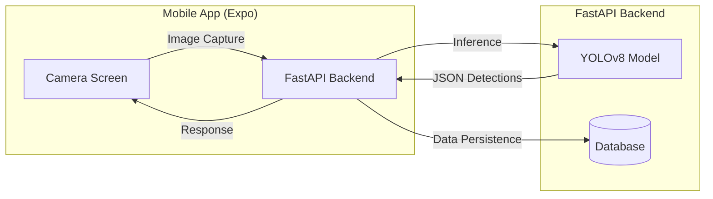

# EcoMap: YOLOv8 Trash Detection Implementation Plan

This document outlines the strategy for implementing a Computer Vision (CV) model to detect trash using a mobile camera, integrated with a FastAPI backend.

## 1. Architecture Overview

We will use a **unified FastAPI backend** written in Python. This allows the YOLOv8 model to run natively within the same server that handles application logic.

## 2. Technical Stack

- **AI Model**: YOLOv8 (Ultralytics) - Nano version for speed.
- **Backend**: FastAPI (Python) - Replaces the original Node.js scaffold.
- **Frontend**: Expo / React Native - Using `expo-camera`.
- **Inference**: Server-side (Client sends image -> Server returns bounding boxes).

## 3. Implementation Roadmap

### Phase 1: Data Acquisition & Training

1. **Source Data**:
   - **TACO Dataset**: Primary source for trash in nature. [tacodataset.org](http://tacodataset.org/)
   - **Roboflow Universe**: Search for "trash detection" for YOLOv8-formatted datasets. [roboflow.com/universe](https://universe.roboflow.com/search?q=trash)
2. **Train Model**:
   - Use Google Colab or Kaggle (free GPUs).
   - Base model: `yolov8n.pt`.
   - Export result: `best.pt`.

### Phase 2: FastAPI Backend Setup

1. Initialize Python environment and `requirements.txt`.
2. Implement **`DetectorService`** to load the model and perform inference.
3. Create API endpoints:
   - `GET /api/health`: Check server and model status.
   - `POST /api/detect`: Accept image file and return detection coordinates.

### Phase 3: Frontend Camera Implementation

1. Install `expo-camera`.
2. Create a camera view component.
3. Implement "Capture & Detect" flow:
   - Capture frame.
   - Upload to `/api/detect`.
   - Render bounding boxes over the UI.

## 4. Dataset Sources Summary

| Dataset      | Type          | Best For                  |
| ------------ | ------------- | ------------------------- |
| **TACO**     | COCO Format   | High-quality nature shots |
| **TrashNet** | Image Folders | Basic classification      |
| **Roboflow** | YOLOv8 Format | Quick training start      |
| **Kaggle**   | Massive sets  | Diversity of trash types  |

---

_Created on 2026-02-22_
